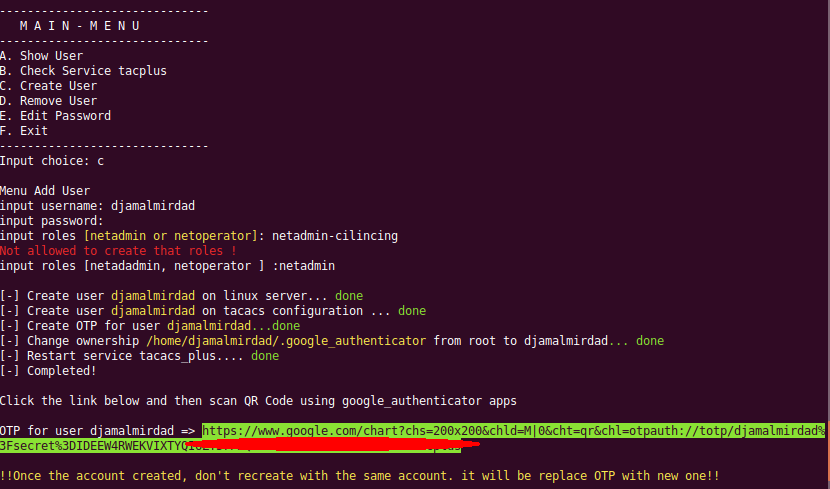

## tacplus-tool

Tools for manage user on tacacs configuration with two factor authentication

##  Requirements

* Python 3.5+
* Paramiko


#### Installation
```bash
apt-get install python3-pip
```

```bash
pip3 install paramiko
```

#### How to use
```bash
python3 tacplus-user.py
```





